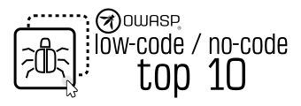

# OWASP Low-Code/No-Code Top 10

https://owasp.org/www-project-top-10-low-code-no-code-security-risks/

The primary goal of the "OWASP Low-Code/No-Code Top 10" document is to provide assistance and education for organizations looking to adopt and develop Low-Code/No-Code applications. The guide provides information about what the most prominent security risks are for such applications, the challenges involved, and how to overcome them.

## Want to help? 

We are always researching, updating the guide, and welcoming contributors to the project.

[Read our contributing guidelines here.](CONTRIBUTING.md)
