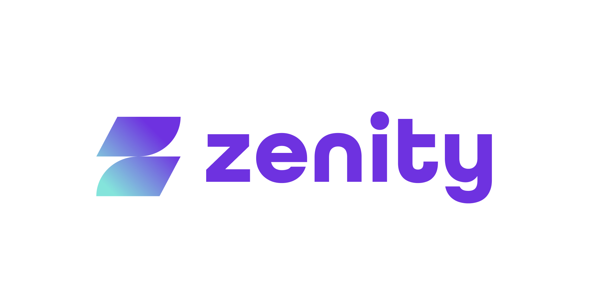

## Contributors

| Name | Affiliation | Contact |
| --- | --- | --- |
| Michael Bargury | Zenity | [Twitter](https://twitter.com/mbrg0) [LinkedIn](https://www.linkedin.com/in/michaelbargury/) |
| Ory Segal | Palo Alto Networks | [Twitter](https://twitter.com/orysegal) [LinkedIn](https://www.linkedin.com/in/orysegal/) |
| Uriel Zilberberg | Zenity | [Twitter](https://twitter.com/UZisReal123) [LinkedIn](https://www.linkedin.com/in/uriel-zilberberg-50916811b/) |

## Project Sponsors
The OWASP Top 10 Low-Code/No-Code Security Risks project is supported by [Zenity](https://www.zenity.io/)
 

